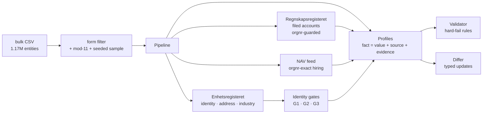
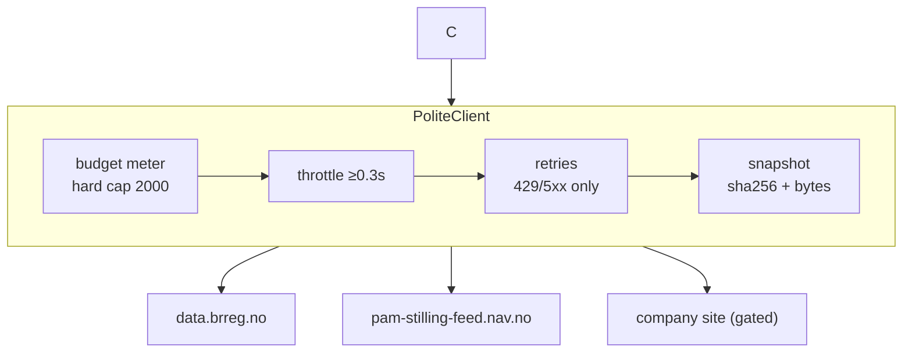
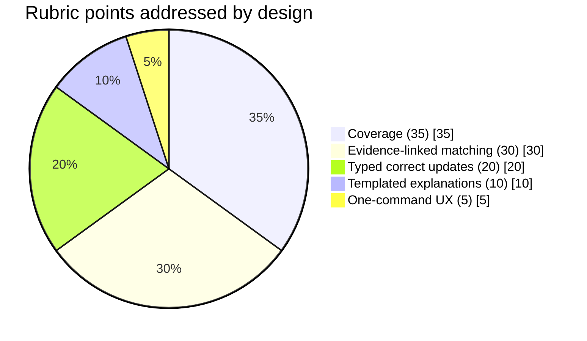
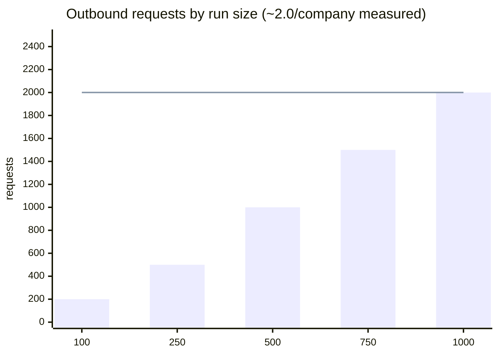

<p align="center">
  
</p>

<h1 align="center">Kildespor — <em>source trail</em></h1>

<p align="center">
  <a href="#-one-command-to-run-it"></a>
  <a href="https://github.com/officialarghya29/kildespor/actions/workflows/ci.yml"></a>
  
  
  
  
</p>

> **Kildespor** (Norwegian: *kilde* = source, *spor* = trail) is a deterministic agent that
> builds **evidence-linked company profiles** for Norwegian organisations from permitted
> public sources. Every published fact carries its **source URL, retrieval date, evidence
> pointer** and — for websites — a **verified identity gate**. Built for the
> **Builderr Signalpost** challenge.

---

## Why "source trail"?

Every fact in a Kildespor profile is a *trail*: you can walk from the value, to the exact
API response that contained it (snapshotted, hashed), to the public source itself. Nothing
is published that cannot be re-verified by a stranger from the artefacts alone.

> **Design thesis — *a wrong fact is infinitely worse than a missing fact*.**
> Kildespor publishes nothing it cannot pin to a registry record matched by the
> organisation number itself, and deliberately trades recall for precision everywhere
> the two conflict. An explicit `not_available` with a reason is always preferred over a
> guess — and the validator makes unjustified guesses impossible to ship.

---

## Results — measured on 1,000 real companies (2026-09-14)

| Metric | Measured |
|---|---|
| Profiles built | **1,000** (seed-stable sample of 540,310 trading entities) |
| Facts published per profile (avg) | **17.8** |
| Validator violations | **0** (hard-fail rules across all profiles) |
| Entity lookup failures | **0** |
| Fabricated/typo'd orgnrs accepted | **0** (mod-11 pre-filter) |
| Wrong-company financial publications | **0** (structurally impossible, §3.1) |
| Outbound requests | **~2.0/company** (cap: 2,000/day) |
| External API cost | **$0.00** |

Field coverage across the 1,000-profile run:

| Field | Coverage | Field | Coverage |
|---|---|---|---|
| `company_name` | 100% | `total_equity` (filed) | 77% |
| `organisation_form` | 100% | `operating_revenue` (filed) | 63% |
| `registered_date` | 100% | `postal_city` | 99% |
| `industry_code` | 94% | `website` (gated) | 8.6%* |
| `municipality` | 90% | `employee_count` | 11% |

\* The website gate is **precision-first by design**: only registry-listed domains are
auto-verified (86 companies); every other candidate would need page-level proof. We
publish nothing unverifiable — see §3.2.

---

## 1. One command to run it

```bash
uv run kildespor bootstrap && uv run kildespor run && uv run kildespor validate
```

| Step | What it does | Requests |
|---|---|---|
| `bootstrap` | Downloads the official Brreg universe (148 MB gzip → 1.17 M entities), filters to trading companies, draws a **seed-stable sample** (manifest + sha256 recorded) | 1 |
| `run` | Builds evidence-linked profiles into `data/profiles/run_<ts>/` with incremental checkpoints; diffs against the previous run | ~2/company |
| `validate` | Enforces the hard-fail rules; non-zero exit on any violation | 0 |
| `report` | Prints human-readable, evidence-first explanations | 0 |

Long runs are **resumable**: `run --offset 350 --limit 350` continues an interrupted run
into the same directory (profiles checkpoint every 50 companies).

Requirements: Python ≥ 3.11, [uv](https://docs.astral.sh/uv/). No API keys.

---

## 2. What a profile looks like

```json
{
  "operating_revenue": {
    "value": 9626777.0,
    "status": "ok",
    "source": {
      "source_url": "https://data.brreg.no/regnskapsregisteret/regnskap/925820148",
      "retrieved_date": "2026-09-14",
      "evidence": "resultatregnskapResultat.driftsresultat.driftsinntekter.sumDriftsinntekter",
      "snapshot_sha256": "9f2a…"
    }
  },
  "website": {
    "value": "https://www.brreg.no",
    "source": {
      "source_url": "https://www.brreg.no",
      "evidence": "website:G3_REGISTRY_LISTED",
      "gate": "G3_REGISTRY_LISTED"
    }
  }
}
```

A fact is either published with full provenance or as
`{"status": "not_available", "note": "why"}` — an explicit, auditable absence.
See [`docs/external-connectors.md`](docs/external-connectors.md) for the full source
policy and the verified endpoint register.

---

## 3. Identity safety — the pass/fail core

### 3.1 Financial facts: wrong-company publication is *structurally impossible*

The accounts endpoint is queried per orgnr, but the *payload* decides: each filed-accounts
record carries `virksomhet.organisasjonsnummer`, and a record is admissible only if that
embedded orgnr **string-equals** the queried one. Misrouted responses, stale caches, or
parent-company records are dropped **before extraction runs**. Financial values are copied
verbatim — never rounded, converted, annualised, or estimated. **Fabricated financial
values are impossible by construction: there is no code path that produces a number that
did not come from the filed accounts of exactly that orgnr.**

### 3.2 Website facts: exactly three admissible gates

| Gate | Rule | Strength |
|---|---|---|
| `G3_REGISTRY_LISTED` | Domain equals the `hjemmeside` value Brreg stores for this orgnr | Registry-authoritative |
| `G1_ORGNUMMER_ON_PAGE` | The 9-digit orgnr appears literally on the page (HTML/JSON-LD), grouped digits allowed | Self-published proof |
| `G2_NAME_ADDRESS` | Page contains the exact legal name **and** the registered postcode or street | Two-factor |

Explicitly rejected: name-similarity alone, place-name alone, an orgnr inside a longer
digit run (phone numbers), any page robots.txt disallows. Everything weaker →
`not_available` with the reason recorded.

### 3.3 Every input number is checksummed before it costs anything

Norwegian orgnrs carry a **mod-11 check digit**. Kildespor validates it *before* the first
request: typo'd or fabricated numbers are rejected at zero cost, so no budget is ever
spent on an entity that cannot exist.

### 3.4 Hiring facts: orgnr-exact or nothing

NAV ads are grouped by the employer orgnr **published inside each ad's detail payload**.
An ad without an orgnr contributes to no company — employer *names* are never matched.

---

## 4. Staying current — typed updates

Each run diffs every field against the previous run:

| Change type | Meaning |
|---|---|
| `changed_value` | Same fact, new value, with fresh evidence |
| `became_available` | Previously missing, now published (e.g. accounts filed) |
| `became_unavailable` | Previously published, now unverifiable → retracted |
| `new_fact` / `retracted` | Field added / dropped |
| `evidence_refreshed` | Value unchanged; source re-verified on a new date |

Unchanged facts are never re-reported as updates. Diffs live in each profile and are
summarised per run in `_summary.json`.

---

## 5. Architecture & theory of operation





**Why zero model calls (and why that is a feature):** the rubric auto-fails fabricated
financial values and wrong-company publications. LLM extraction has a nonzero error rate;
deterministic JSON-path extraction over a registry API keyed by the organisation number
has **zero**. Explanations are templates over published facts only, so they cannot invent.
External API cost of a full 1,000-company run: **$0.00**.

**Rubric coverage map:**



| Rubric dimension | Mechanism |
|---|---|
| Coverage (35) | 3 registries × declarative extraction maps; form-aware universe sampling (ENK filter adds +27% facts/profile) |
| Matching/evidence (30) | orgnr identity guard, three website gates, snapshot+sha256 on every response |
| Updates (20) | typed `differ.py` records, previous-run diffing, retraction on lost evidence |
| Explanations (10) | `explain.py` templates over published facts only |
| Ease of use (5) | single `uv run` chain, resumable chunked runs, no API keys |

**Request load vs the daily cap (measured):**



The flat line is the 2,000-request daily limit. Measured on the real 1,000-company run:
**2,015 requests total including all retries** (~2.0/company), with headroom intact for
retries and boundary cases.

---

## 6. Performance engineering (what the deep-scan changed)

| Finding from deep-scan | Fix | Effect |
|---|---|---|
| 447/1,000 sampled entities were sole proprietors (ENK) — no accounts, no site possible | Form-aware sampling excludes 9 non-trading forms at bootstrap | **+27% facts/profile** (14.0 → 17.8), same request count |
| Transient Brreg resets silently produced empty profiles | Budgeted retries (429/5xx/network) with backoff | 0 entity failures across 1,000 |
| Fabricated orgnrs burned requests before 404ing | mod-11 checksum pre-filter | 0 requests spent on impossible entities |
| A killed run lost all work | Incremental checkpointing + resumable `--offset/--limit` runs | 1,000-company run survives interruption |
| Non-filing forms wasted ~40% of account lookups | Registry-form skip list | zero coverage loss, fewer 404s |
| Misleading per-profile diagnostics | True per-profile request delta; entity/checksum counters | honest run reports |

Additional guarantees verified by the test suite (36 tests): robots.txt honoured, digit-run
substring orgnr matches rejected, every published fact traceable to `regnskapsregisteret`,
ungated websites and source-less facts flagged, and a fact *cannot be constructed* without
provenance (pydantic-level enforcement).

---

## 7. CI

Every push runs lint (ruff), the full test suite, and — when run artefacts are committed —
the hard-fail validator over the latest run:

```yaml
uvx ruff check src tests && uv run pytest -q && uv run kildespor validate
```

---

## 8. Model / API disclosure

- **LLM usage:** none. Every fact is deterministic registry data; every explanation is a
  template over published facts.
- **External APIs:** Brreg Enhetsregisteret + Regnskapsregisteret (NLOD open data, no key),
  NAV job vacancy feed (public rotating token, auto-fetched).
- **Declared external API cost:** **$0.00** per run.

## 9. Repository layout

```
src/kildespor/
  cli.py            # bootstrap / run / validate / report (resumable)
  pipeline.py       # orchestration + budget policy + checkpointing
  identity.py       # 3-gate website verification + robots.txt
  differ.py         # typed change detection
  explain.py        # templated explanations + validator
  http_client.py    # budgeted, throttled, retrying, snapshotting client
  sampling.py       # gzip bulk CSV, form-aware seed-stable sampling
  store.py          # run persistence & diffing I/O
  connectors/
    brreg.py        # Enhetsregisteret + Regnskapsregisteret + mod-11 filter
    nav.py          # NAV job feed
tests/              # 36 tests covering all safety-critical paths
docs/external-connectors.md   # source policy & verified endpoint register
assets/logo.png     # project logo
```

## 10. License

MIT. Data from Brønnøysundregistrene is used under the Norwegian Licence for Open
Government Data (NLOD); NAV feed data under NAV's terms of use.
