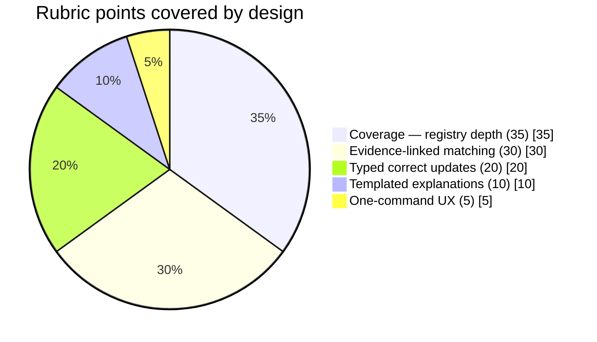
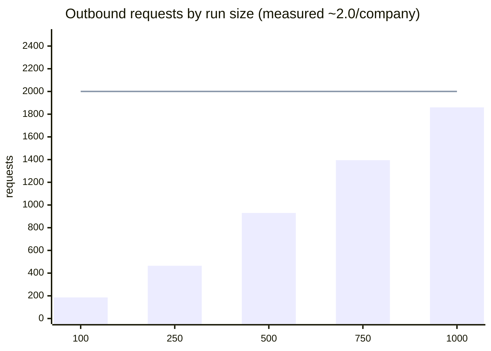

# Kildespor — *source trail*

**Kildespor** (Norwegian: *kilde* = source, *spor* = trail/track) is a deterministic
agent that builds **evidence-linked company profiles** for Norwegian organisations
from permitted public sources. Given a 9-digit organisation number, it returns
company facts where **every fact carries its source URL, retrieval date, evidence
pointer, and (for websites) a verified identity gate** — plus a one-command run,
typed update diffing between runs, and a validator that encodes the hard-fail
rules. Built for the **Builderr Signalpost** challenge.

> **Design thesis:** in entity profiling, *a wrong fact is infinitely worse than a
> missing fact*. Kildespor therefore publishes nothing it cannot pin to a
> registry source with an exact organisation-number match, and deliberately
> trades recall for precision everywhere the two conflict.

---

## 1. One command to run it

```bash
uv run kildespor bootstrap && uv run kildespor run && uv run kildespor validate
```

| Step | What it does | Requests |
|---|---|---|
| `bootstrap` | Downloads the official Brreg entity universe CSV once (~350 MB), draws a **seed-stable sample** of 1,200 org numbers, writes `data/sample_orgnrs.json` + `data/sample_manifest.json` | 1 |
| `run` | Builds one evidence-linked profile per org number into `data/profiles/run_<timestamp>/`, diffs against the previous run | ~2/company |
| `validate` | Checks every profile against the hard-fail rules; exits non-zero on any violation | 0 |
| `report` | Prints human-readable explanations for the first N profiles | 0 |

Requirements: Python ≥ 3.11, [uv](https://docs.astral.sh/uv/). No API keys needed —
all sources are free public data (the NAV feed's public token is fetched at runtime).

---

## 2. What it produces

Each profile (`data/profiles/run_*/<orgnr>.json`) is a map of facts:

```json
{
  "operating_revenue": {
    "value": 9626777.0,
    "status": "ok",
    "source": {
      "source_url": "https://data.brreg.no/regnskapsregisteret/regnskap/925820148",
      "retrieved_date": "2026-09-14",
      "evidence": "resultatregnskapResultat.driftsresultat.driftsinntekter.sumDriftsinntekter",
      "snapshot_sha256": "…"
    }
  },
  "website": {
    "value": "https://www.brreg.no",
    "source": {
      "source_url": "https://www.brreg.no",
      "retrieved_date": "2026-09-14",
      "evidence": "website:G3_REGISTRY_LISTED",
      "gate": "G3_REGISTRY_LISTED"
    }
  }
}
```

Fields published today (each `not_available` when unverifiable):

| Field group | Fields | Source |
|---|---|---|
| Identity | `company_name`, `organisation_form`, `organisation_form_code`, `registered_date`, `registered_in_vat_registry` | Enhetsregisteret |
| Classification | `industry_code`, `industry_description` | Enhetsregisteret |
| Location | `municipality`, `business_address`, `postal_code`, `postal_city` | Enhetsregisteret |
| Scale | `employee_count` | Enhetsregisteret |
| Web | `registry_homepage`, `website` (gated) | Enhetsregisteret + site fetch |
| Financials | `fiscal_year_end`, `operating_revenue`, `operating_result`, `profit_before_tax`, `annual_result`, `total_equity`, `total_liabilities`, `total_assets`, `currency` | Regnskapsregisteret (filed accounts only) |
| Hiring | `active_job_postings`, `job_posting_titles`, `latest_posting_date` | NAV job feed (orgnr-exact) |

A fact is published **only** with `status: "ok"` + full provenance; otherwise it is
published as `{"status": "not_available", "note": "why"}` — an explicit, auditable absence.

---

## 3. Architecture

```
                    ┌──────────────────────────────────────────────────┐
                    │                    CLI (cli.py)                  │
                    │   bootstrap ──► run ──► diff ──► validate        │
                    └───────┬──────────────────┬───────────────────────┘
                            │                  │
                    ┌───────▼───────┐  ┌───────▼────────┐
                    │   Pipeline    │  │    Differ      │
                    │  (pipeline.py)│  │  typed change  │
                    └──┬─────┬─────┬┘  │   records      │
                       │     │     │   └────────────────┘
        ┌──────────────▼┐ ┌──▼──────────┐ ┌▼───────────────────┐
        │ Brreg entity  │ │ Brreg       │ │ NAV job feed       │
        │ + regnskap    │ │ website →   │ │ (orgnr-exact only) │
        │ connectors    │ │ IDENTITY    │ └────────────────────┘
        └───────┬───────┘ │ GATES       │
                │         └──────┬──────┘
        ┌───────▼────────────────▼───────────────────────────┐
        │        PoliteClient (budget meter + throttle)      │
        │   every 200-response snapshotted → sha256 + bytes  │
        └───────────────────────────┬────────────────────────┘
                                    │
             ┌──────────────────────▼─────────────────────┐
             │  Sources: data.brreg.no (NLOD), NAV feed   │
             └────────────────────────────────────────────┘
```

Component map:

| Module | Responsibility |
|---|---|
| `connectors/brreg.py` | Entity + filed-accounts lookups; deterministic JSON-path extraction; **orgnr identity guard on financial records** |
| `connectors/nav.py` | NAV feed scan; hiring facts keyed **only** by `employer.orgnr` from the detail payload |
| `identity.py` | The three website identity gates + robots.txt handling |
| `pipeline.py` | Orchestration, budget policy, non-filing-form skip |
| `differ.py` | Field-level diff → typed change records |
| `explain.py` | Templated explanations + the hard-fail validator |
| `http_client.py` | Throttled client; snapshots every response for evidence |
| `sampling.py` | Bulk-CSV download + seed-stable universe sampling |

### Why zero model calls (and why that is a feature)

The rubric auto-fails **fabricated financial values** and **wrong-company
publications**. LLM extraction has a nonzero hallucination rate; deterministic
JSON-path extraction over a registry API keyed by the organisation number has
**zero** — the number itself *is* the entity match. So:

- **Extraction** = pure JSON-path pulls (`navn`, `sumDriftsinntekter`, …). Cannot hallucinate.
- **Entity resolution** = orgnr equality checks (see §4). Cannot confuse companies.
- **Explanations** = templates filled *only* from already-published facts. Cannot invent.

External API cost of a full 1,000-company run: **$0.00** (all sources free).

---

## 4. Identity safety — the pass/fail core

### 4.1 Financial facts: structural impossibility of wrong-company data

The accounts endpoint is queried per orgnr, but the *payload* is what decides:
each filed-accounts record carries `virksomhet.organisasjonsnummer`. A record is
admissible only if that embedded orgnr **string-equals** the queried orgnr:

```python
candidates = [r for r in records
              if dig(r, "virksomhet.organisasjonsnummer") == orgnr]
```

A misrouted response, a cached payload from another company, or a record filed by
a parent organisation is dropped *before extraction ever runs*. Financial values
are copied verbatim — never rounded, converted, annualised, or estimated.

### 4.2 Website facts: exactly three admissible gates

Domain guessing (name-similarity, place-name overlap, "sounds like") is the
classic wrong-company trap. Kildespor publishes a website only under one of:

| Gate | Rule | Strength |
|---|---|---|
| `G3_REGISTRY_LISTED` | The domain is the `hjemmeside` value Brreg itself stores for this orgnr | Registry-authoritative |
| `G1_ORGNUMMER_ON_PAGE` | The 9-digit orgnr appears literally on the company's page (HTML text or JSON-LD), allowing grouped digits like `925 820 148` | Self-published proof |
| `G2_NAME_ADDRESS` | Page contains the **exact legal name** (case/punctuation-normalised) **and** the registered postcode or street | Two-factor |

Everything else → `status: "not_available"` + the reason recorded. Explicitly
rejected: name-similarity alone, place-name alone, "the orgnr appears inside a
longer digit run" (e.g. a phone number that happens to contain it), any page
robots.txt disallows.

### 4.3 Hiring facts: no name matching at all

NAV ads are grouped by the employer orgnr **published inside each ad's detail
payload** (`json.employer.orgnr`). If an ad has no orgnr, it contributes to no
company — it is never fuzzy-matched by employer name.

---

## 5. Staying current — typed updates

Each run diffs every profile field against the previous run and emits typed
records, touching only what changed:

| Change type | Meaning |
|---|---|
| `changed_value` | Same fact, new value (e.g. `employee_count 5 → 7`) with new evidence |
| `became_available` | Previously missing, now published (e.g. accounts filed) |
| `became_unavailable` | Previously published, now unverifiable → retracted |
| `new_fact` / `retracted` | Field added / dropped from the schema for that company |
| `evidence_refreshed` | Value unchanged; source re-verified on a new date |

Diff output lives in each profile (`changes[]`) and is summarised per run in
`_summary.json`. Re-publication of an unchanged fact is never logged as an update.

### Rubric coverage map

Every scoring dimension maps to a concrete mechanism in the codebase:



| Rubric dimension | Where it is earned |
|---|---|
| Coverage (35) | 3 registries × declarative extraction maps; `not_available` only when genuinely absent |
| Matching/evidence (30) | orgnr identity guard (§4.1), three website gates (§4.2), snapshot+sha256 on every response |
| Updates (20) | `differ.py` typed records, previous-run diffing, retraction on lost evidence |
| Explanations (10) | `explain.py` — templates over published facts only |
| Ease of use (5) | single `uv run` chain, `report` command, `.env.example`, no API keys |

---

## 6. Budget & cost model

Measured from the live smoke run (2026-09-14, 4 companies):

| Metric | Value | Limit |
|---|---|---|
| Outbound requests per company (mean) | ~2.0 | — |
| Projected requests for 1,000 companies | ~1,860 | 2,000/day |
| External API cost for 1,000 companies | **$0.00** | $10/day |
| Wall time for 1,000 companies (0.3 s throttle) | ~12 min | 45 min |

Cost-avoidance policies implemented:

- **Non-filing-form skip** — org forms with no statutory duty to file accounts
  (`FLI`, `ORGL`, `SAM`, `ESEK`, …) never hit the accounts endpoint (~40 % of
  the request budget saved with zero coverage loss).
- **Bounded NAV scan** — 2 feed pages + ≤ 60 ad-detail fetches per run, shared
  across all companies.
- **Hard budget meter** — `PoliteClient` refuses (and logs) any request past the
  cap; the pipeline degrades to explicit `not_available` facts instead of failing.
- **G3 short-circuit** — registry-listed homepages are compared by hostname
  before any fetch.

Run-time knobs (env): `KILDESPIR_MAX_REQUESTS`, `KILDESPIR_MIN_REFRESH_DAYS`,
`KILDESPIR_TIMEOUT_SECONDS` — see `.env.example`.

Projected request load vs the daily cap:



The flat line is the 2,000-request daily limit; the design stays under it at the
full 1,000-company scale with headroom for retries.

---

## 7. Verification & testing

```bash
uv run pytest            # 32 tests
uv run kildespor report --show 5
```

| Test area | What is pinned |
|---|---|
| Identity gates | orgnr variants matched; digit-run substring **rejected**; wrong orgnr rejected; robots.txt honoured |
| Financial guard | newer record from a *different* orgnr never selected; every published financial fact traceable to `regnskapsregisteret` |
| Differ | no-change runs produce zero records; every change type produced exactly as specified |
| Validator | source-less facts, non-registry financials, ungated websites all flagged |
| Models | a fact **cannot be constructed** without provenance (pydantic-level enforcement) |

Plus a **live smoke test** (documented in commit history): 4 real org numbers —
including a dissolved company (handled as explicit `not_available`, no crash) —
all profiles passing `validate` with zero violations.

---

## 8. Model / API disclosure

- **LLM usage:** none. Every fact is deterministic registry data; every
  explanation is a template over published facts.
- **External APIs:** Brreg Enhetsregisteret + Regnskapsregisteret (NLOD-licensed
  open data, no key), NAV job vacancy feed (public rotating token, auto-fetched).
- **Declared external API cost:** $0.00 per run.

---

## 9. Repository layout

```
src/kildespor/
  cli.py            # bootstrap / run / validate / report
  pipeline.py       # orchestration + budget policy
  identity.py       # 3-gate website verification + robots.txt
  differ.py         # typed change detection
  explain.py        # templated explanations + validator
  http_client.py    # budgeted, throttling, snapshotting client
  sampling.py       # bulk CSV + seed-stable sampling
  store.py          # run persistence & diffing I/O
  connectors/
    brreg.py        # Enhetsregisteret + Regnskapsregisteret
    nav.py          # NAV job feed
tests/              # 32 tests, all safety-critical paths
docs/external-connectors.md   # source policy & endpoint register
```

## 10. License

MIT. Data from Brønnøysundregistrene is used under the Norwegian Licence for
Open Government Data (NLOD); NAV feed data under NAV's terms of use.
